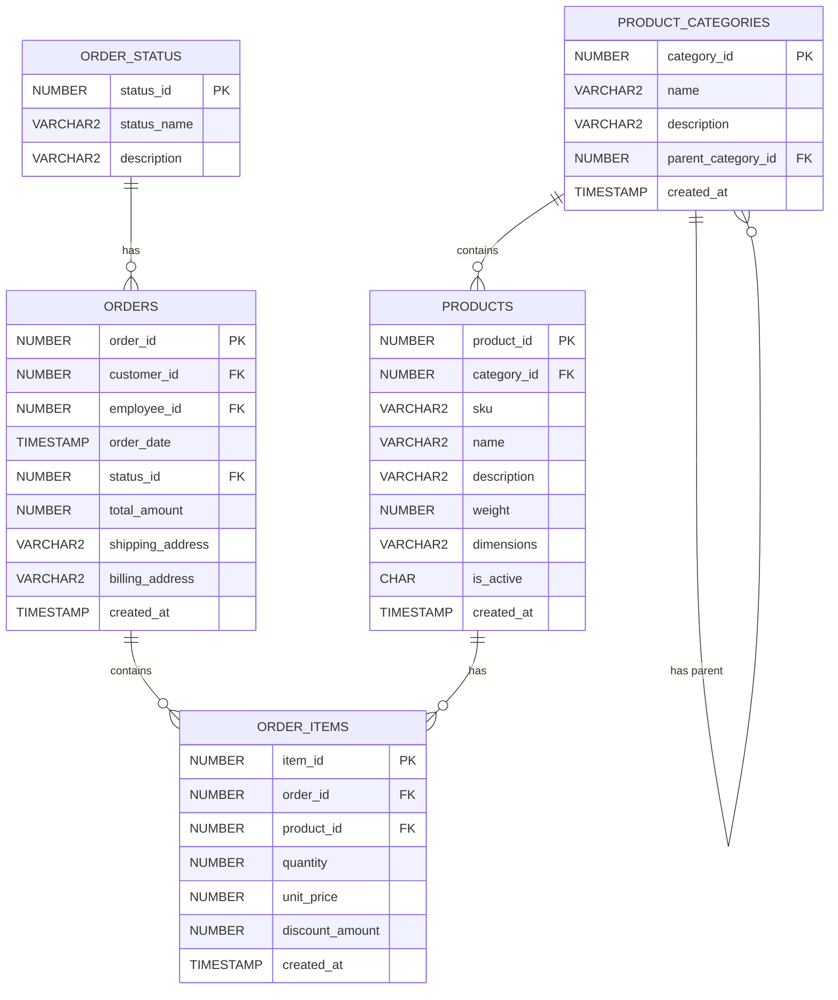

# Database Schema for Best-Selling Products

This diagram shows the core tables needed for analyzing best-selling products. The main relationships are:

1. Products belong to Product Categories (which can have parent categories)
2. Orders contain Order Items, which reference specific Products
3. Orders have a Status from Order_Status table
4. Order Items track quantity and price for each product in an order